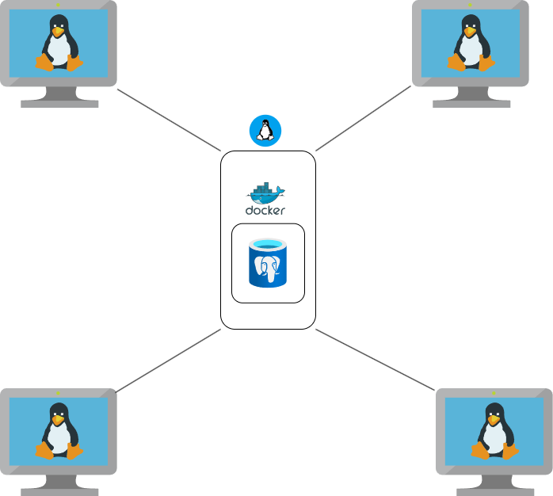

# Introduction

Linux Cluster Monitoring Agent is system monitoring tool that allows users to monitor their Linux system information and usage. It collects hardware specifications and real-time resource usage from Linux hosts and stores this information in a PostgreSQL database. This tool is intended for use by the Jarvis Linux Cluster Administration team that manages a Linux cluster with multiple nodes. The project makes use of the following technologies:

- **Bash** scripting for automation
- **Docker** for provisioning PostgreSQL instance
- **PSQL** for database interactions
- **crontab** for scheduling periodic data collection jobs
- **Git/Gitflow** for version control

# Quick Start

##### 1. Create/Start PostgreSQL instance using docker
```bash
	./scripts/psql_docker.sh create <db_username> <db_password>
	./scripts/psql_docker.sh start
```
##### 2. Create the host_agent database
```
	psql -h localhost -U <db_username> -W
	CREATE DATABASE host_agent;
```
##### 3. Create tables using DDL
```	
	psql -h localhost -U <db_username> -d host_agent -f sql/ddl.sql
```
##### 4. Insert hardware specification data
```
	./scripts/host_info.sh localhost 5432 host_agent <db_username> <db_password>
```
##### 5. Insert hardware usage data
```
	./scripts/host_usage.sh localhost 5432 host_agent <db_username> <db_password>
```
##### 6. Schedule the usage script every minute
```
crontab -e
```
###### *Add the following cron job*
```
	* * * * * bash /path/to/host_usage.sh localhost 5432 host_agent <db_username> <db_password> > 	/tmp/host_usage.log
```

# Implementation

## Architecture



The Linux Cluster Monitoring tool consists of a host server running a centralized PostgreSQL database managed through Docker. This database is connected to multiple Linux nodes, each running two Bash scripts that collect system hardware information and resource usage data, and send it to the database container.

## Scripts

#### *Psql_docker.sh*
Manages the PostgreSQL container lifecycle (create, start, stop).

```bash
# Usage
./scripts/psql_docker.sh start|stop|create <db_user> <db_password>

# Create a new PostgreSQL container
./scripts/psql_docker.sh create <db_user> <db_password>

# Start the container
./scripts/psql_docker.sh start

# Stop the container
./scripts/psql_docker.sh stop

```

#### *host_info.sh*
Gets hardware specifications from the node.

```bash
# Usage
./scripts/host_info.sh <psql_host> <psql_port> <db_name> <psql_user> <psql_password>

# Example
./scripts/host_info.sh localhost 5432 host_agent <db_username> <db_password>

```

#### *host_usage.sh*
Gets the usage data from the node.

```bash
# Usage
./scripts/host_usage.sh <psql_host> <psql_port> <db_name> <psql_user> <psql_password>

# Example
./scripts/host_usage.sh localhost 5432 host_agent <db_user> <db_password>

```
#### *crontab -e*
Automate getting the host_usage script every minute.

```bash
# Open the crontab editor
crontab -e

# Add this line
* * * * * bash /absolute/path/to/linux_sql/scripts/host_usage.sh localhost 5432 host_agent josh rocky1234 > /tmp/host_usage.log

```

#### *ddl.sql*
Creates the host info and host usage table.

```
psql -h localhost -U postgres -d host_agent -f sql/ddl.sql
```

## Database Modeling

- **Host_info table**

| Column Name  | Type   | Description   |
|----------|--------|---------------|
| id | SERIAL PRIMARY KEY | unique ID per host |
| hostname | VARCHAR | Host system name |
| cpu_number | INT2 | Number of CPUs |
| cpu_architecture | VARCHAR | CPU architecture |
| cpu_model | VARCHAR | CPU mode name |
| cpu_mhz | FLOAT8 | CPU speed in MHz |
| l2_cache | INT4 | L2 cache size (KB) |
| timestamp | TIMESTAMP | Entry creation time |
| total_mem | INT4 | Total memory (KB) |

- **Host_usage table**

| Column Name  | Type   | Description   |
|----------|--------|---------------|
| timestamp |  TIMESTAMP | Entry creation time |
| host_id | SERIAL | ID referencing host_info |
| memory_free | INT4 | Free memory |
| cpu_idle | INT2 | percentage of CPU idle |
| cpu_kernel | INT2 | percentage of kernel being used |
| disk_io | INT4 | Disk I/O count |
| disk_available | VARCHAR | Available disk space |


# Test

The monitoring agent scripts were manually tested on a single host machine to ensure their integrity and correctness. Each script was executed individually with sample arguments, and the outputs were compared against system command results and verified against the data stored in the PostgreSQL database.

- For **host_info.sh**, hardware attributes were validated upon initial registration.

- For **host_usage.sh**, system usage metrics were validated and confirmed to update correctly every minute.

- The **ddl.sql** file was verified by inspecting the PostgreSQL database to ensure that the tables were created correctly and populated with sample values.

These tests confirmed that the agent accurately collected data and successfully sent it to the database.

# Deployment

The project is deployed on a single host machine running a PostgreSQL instance inside a Docker container. All scripts and related files are version-controlled using Git and hosted on GitHub.

- The **PostgreSQL** database is created and managed through the **psql_docker.sh** script.

- The **host_info.sh** script is executed once to register the host’s hardware information.

- The **host_usage.sh** script is automated to run every minute using a cron job for continuous data collection.

# Improvements

- *Enhanced Error Handling and Logging*- Implement clear success and error messages to simplify debugging and improve overall user experience.

- *Graphical User Interface (GUI)*- Develop a lightweight interface to visualize system metrics and trends, improving usability and monitoring efficiency.

- *Single Script Execution*- Combine all automation steps into one master script that handles setup, data collection, and scheduling for easier deployment.

